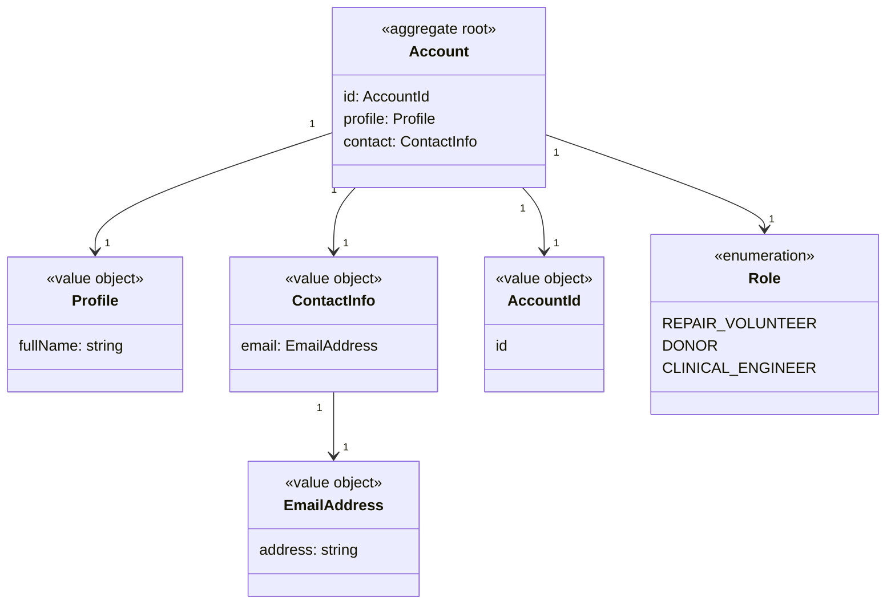

# Account Architecture

## Domain Model

```mermaid
classDiagram

class Account {
  <<aggregate root>>
  id: AccountId
  profile: Profile
  contact: ContactInfo
}

class Profile {
  <<value object>>
  fullName: string
}

class ContactInfo {
  <<value object>>
  email: EmailAddress
}

class EmailAddress {
  <<value object>>
  address: string
}

class AccountId {
  <<value object>>
  id
}

class Role {
  <<enumeration>>
  REPAIR_VOLUNTEER
  DONOR
  CLINICAL_ENGINEER

}

Account "1" --> "1" AccountId
Account "1" --> "1" Role
Account "1" --> "1" ContactInfo
Account "1" --> "1" Profile
ContactInfo "1" --> "1" EmailAddress
```

### To be discussed 🚧🚧:

- Finalise role names
