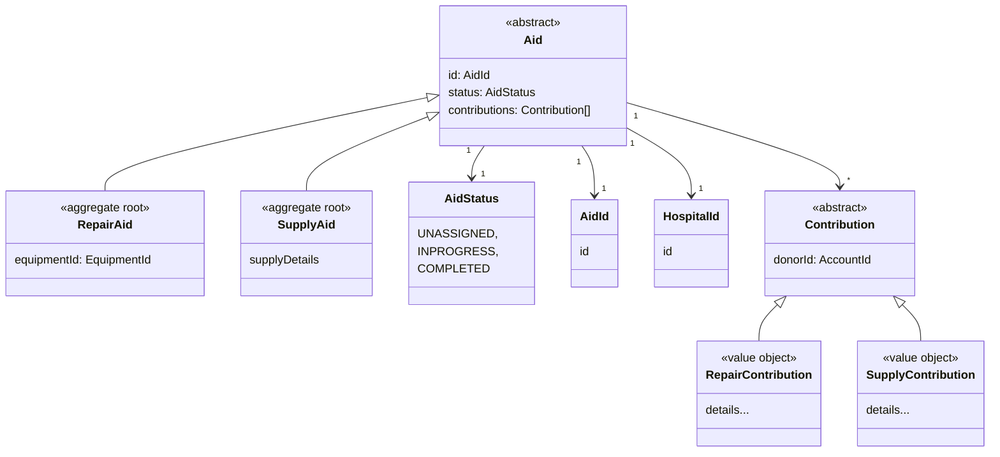

# Aid Architecture

## Domain Model

```mermaid
classDiagram

class Aid {
  <<abstract>>
  id: AidId
  status: AidStatus
  contributions: Contribution[]
}

class RepairAid {
  <<aggregate root>>
  equipmentId: EquipmentId
}

class SupplyAid {
  <<aggregate root>>
  supplyDetails
}

class AidStatus {
  UNASSIGNED,
  INPROGRESS,
  COMPLETED
}

class AidId {
  id
}

class HospitalId {
  id
}

class Contribution {
  <<abstract>>
  <<value object>>
  donorId: AccountId
}

class RepairContribution {
  <<value object>>
  details...
}

class SupplyContribution {
  <<value object>>
  details...
}


Aid "1" --> "1" AidStatus
Aid "1" --> "1" AidId
Aid "1" --> "1" HospitalId
Aid <|-- RepairAid
Aid <|-- SupplyAid
Aid "1" --> "*" Contribution
Contribution <|-- RepairContribution
Contribution <|-- SupplyContribution

```

### To be discussed 🚧🚧:

- Do we want to allow a donor to contribute to multiple aids?
