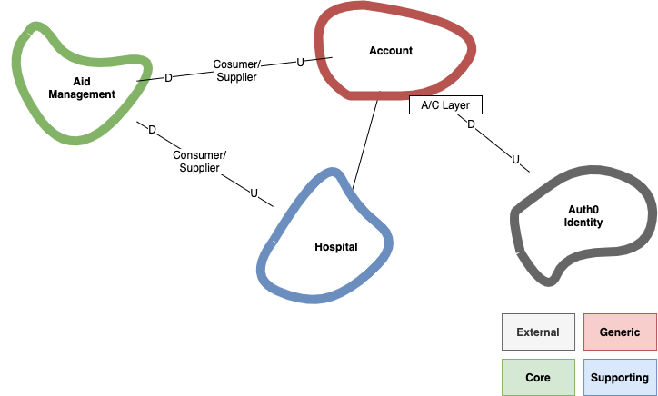

# Architecture Vision

Logical view of our architecture.

## Context Map

Context map is the base of our architecture modularity. It is derived from
HospitalAid strategy and domain language. It shows all the contexts that we are
dealing with in our domain. It allows us to strategise the view of our model
development across our project and others we need to integrate with.

## Layered Architecture

> When the domain-related code is diffused through such a large amount of other
> code, it becomes extremely difficult to see and to reason about. Superficial
> changes to the UI can actually change business logic. To change a business
> rule may require meticulous tracing of UI code, database code, or other
> program elements. Implementing coherent, model-driven objects becomes
> impractical. Automated testing is awkward. With all the technologies and logic
> involved in each activity, a program must be kept very simple or it becomes
> impossible to understand.

These are the layers of architecture that we have, and we attempt to apply it
every context we have.

As much as we want to follow the existing terminologies, with a modern
technology, there are jargons that are shared that might caused confusion. We'd
like our layers to be clearly understood, we therefore try to avoid some words
like services or application for example.

These are the definition of each layers in our architecture:

- Web application

  The web application that will compose all of our UI components.

  Responsibilities:

  - Implements pages and routing mechanism
  - Contains domain interaction into UI components
  - Delegates business logic (if any) into domain layers

- Client

  Responbilities:

  - Abstracts remote API calls into objects

- Driving Adapter

  The word `driving` is taken from the Hexagonal Architecture. Do note that we
  don't distinguish application service (DDD) at the moment, so this adapter may
  contain application services.

  Responbilities:

  - Provides DTOs to callers
  - Provides application services
  - Does not have domain logic
  - Coordinates domain objects
  - Handles protocol details

- Domain

  Contains our business rules and use cases. Will not contain any technologies,
  and any outward dependencies.

  Responsibilities:

  - Contains core business logic
  - Encapsulates business logic in objects

- Driven Adapter

  The word `driven` is taken from the Hexagonal Architecture.

  Responsibilities:

  - Persists entities into data storage
  - Queries entities from data storage
  - Sends emails or SMS

- Data

  Responbilities:

  - Ingests external data into our domain
  - Publishes domain data for analytics purposes

- Infrastructure

  This layer is not to be confused with Infrastructure Services (DDD).

  Responsibilities:

  - Provisions infrastructure
