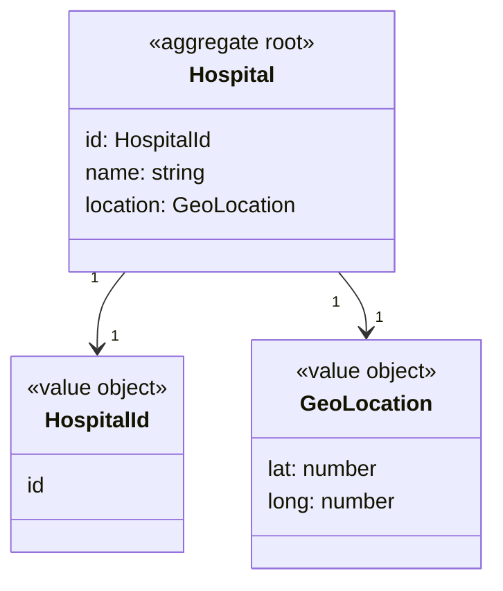

# Hospital Architecture

## Domain Model

```mermaid
classDiagram

class Hospital {
  <<aggregate root>>
  id: HospitalId
  name: string
  location: GeoLocation
}

class GeoLocation {
  <<value object>>
  lat: number
  long: number
}

class HospitalId {
  <<value object>>
  id
}

Hospital "1" --> "1" HospitalId
Hospital "1" --> "1" GeoLocation

```
