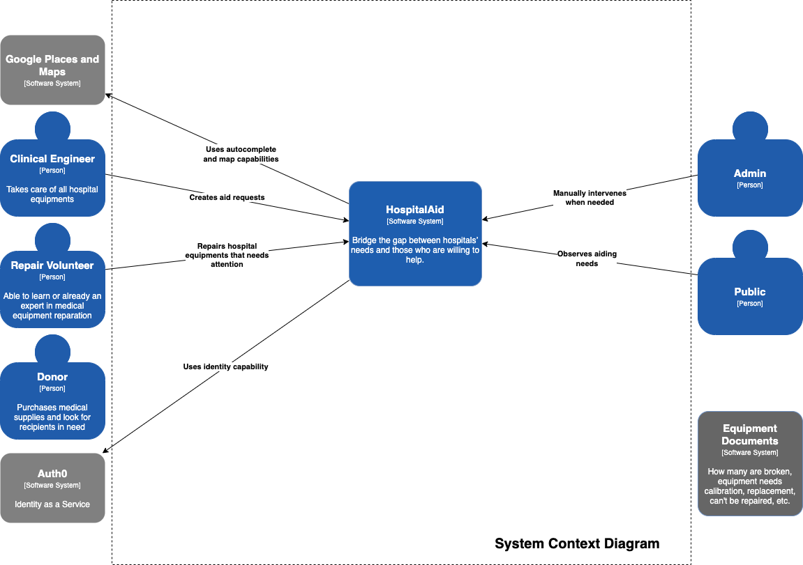
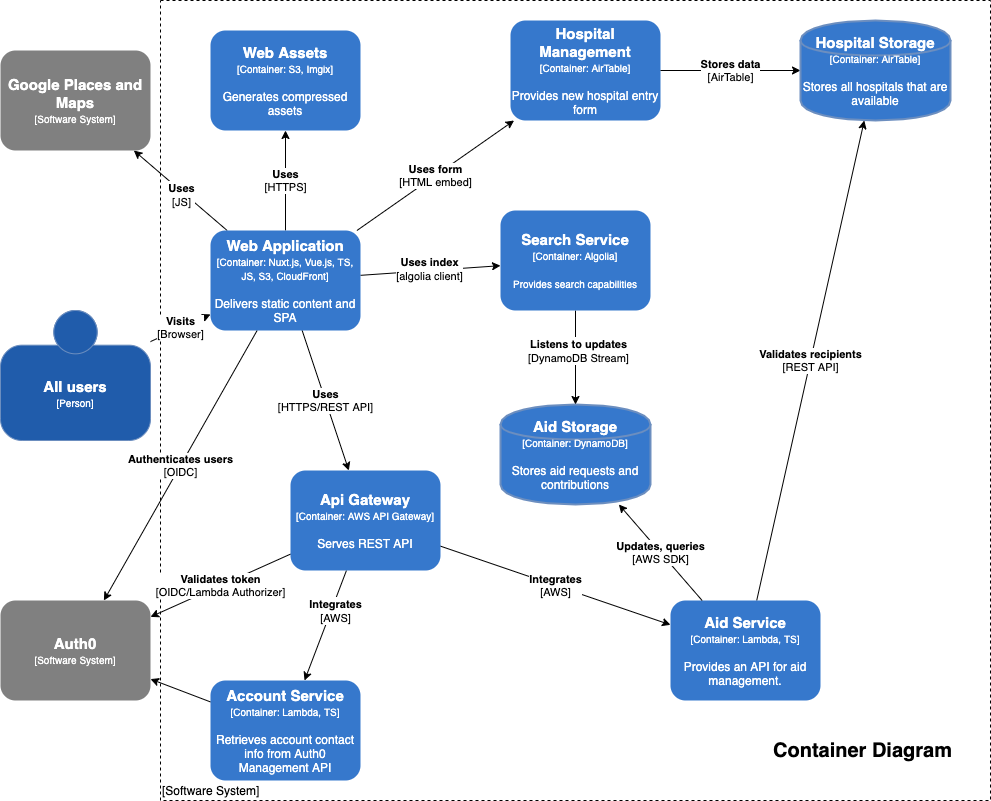

# Technology Vision

This is more of a physical view of our architecture showing the technologies
that we use. These diagrams are [C4 model diagrams](https://c4model.com/), they
should treat this like a map where you can zoom in and out when you need to.

Treat this like a map, zoom in and zoom out.

## Level 1 - System Context Diagram

## Level 2 - Container Diagram

